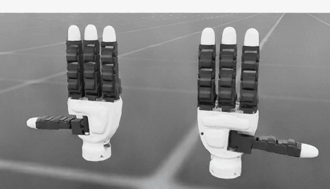

# Allegro Hand V5 Sense — Isaac Lab Pipeline

**English** | [한국어](README.kr.md)

  

Spawns the Wonik Robotics **Allegro Hand V5 "sense" (tactile) left and right hands** in Isaac Lab, and
carries them through to training. Ships a runnable demo (`run_sim.py`) plus a reinforcement learning
environment you can build a task on top of.

<p align="center">
  
</p>

<p align="center"><sub>Both hands curling their fingers in sequence — the <code>wave</code> trajectory. Full clip: <a href="docs/media/demo.mp4">docs/media/demo.mp4</a></sub></p>

---

## Quick Start

Run with a python interpreter that has Isaac Lab 3.0 installed. **No install step** — you get moving
hands straight away.

```bash
python run_sim.py                 # both hands, wave trajectory
python run_sim.py --side right    # right hand only
python run_sim.py --traj grasp    # close / hold / open
```

For Isaac Lab itself, follow the [official installation guide](https://isaac-sim.github.io/IsaacLab/main/source/setup/installation/index.html).
Keep this repository **outside** the `IsaacLab` directory.

To use the training environment, install the extension package:

```bash
python -m pip install -e source/v5_sense_isaaclab_pipeline

python scripts/list_envs.py                                                    # confirm registration
python scripts/random_agent.py --task=Template-V5-Sense-Dual-Hand-Direct-v0 --num_envs=4
python scripts/skrl/train.py   --task=Template-V5-Sense-Dual-Hand-Direct-v0 --num_envs=4096 --headless
```

---

## Repository Structure

```text
├── run_sim.py                     // demo entry point (no install, no Gym)
├── data/                          // playback trajectories (wave.npy, grasp.npy)
├── asset/
│   ├── v5_sense_left/             // left hand USD (converted from URDF)
│   └── v5_sense_right/            // right hand USD
├── scripts/
│   ├── random_agent.py            // random actions
│   ├── zero_agent.py              // zero actions
│   ├── list_envs.py               // registered task list
│   ├── make_trajectories.py       // regenerate data/*.npy
│   └── skrl/{train,play}.py       // skrl PPO training / playback
├── source/v5_sense_isaaclab_pipeline/
│   └── v5_sense_isaaclab_pipeline/
│       ├── assets/                // ArticulationCfg for both hands
│       └── tasks/direct/allegro_v5_sense/   // DirectRLEnv environment
└── docs/                          // detailed documentation
```

---

## Two entry points

| | `run_sim.py` | `Template-V5-Sense-Dual-Hand-Direct-v0` |
|---|---|---|
| Purpose | Check the hands load and articulate | Reinforcement learning |
| Install | Not required | Needs `pip install -e` |
| Built on | `SimulationContext` + `Articulation` directly | Gym-registered `DirectRLEnv` |
| Motion | Replays `data/*.npy` trajectories | Policy emits joint targets |
| Hands | `--side left\|right\|both` | Both, fixed |

Environment at a glance — 32 actions (16 joints per hand), 64 observations (joint positions and
velocities), and a **placeholder reward of 0**. See [docs/custom_training.md](docs/custom_training.md)
for how to put a task on top.

---

## Documentation

| Document | Contents |
|---|---|
| [docs/environment.md](docs/environment.md) | Environment spec, joint mapping, pose and dimensions, CLI options |
| [docs/custom_training.md](docs/custom_training.md) | Writing rewards and terminations, adding objects, registering a task, training |
| [docs/asset_notes.md](docs/asset_notes.md) | URDF→USD conversion quirks and their workarounds (**including the left thumb mirroring bug**) |
| [docs/troubleshooting.md](docs/troubleshooting.md) | Common errors, IDE and Omniverse extension setup |

If you plan to re-export the assets or change the hand configuration, read
[docs/asset_notes.md](docs/asset_notes.md) first.
